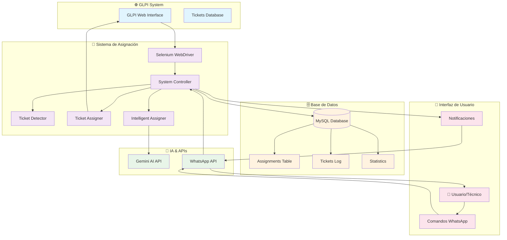
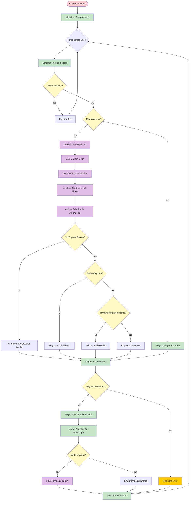
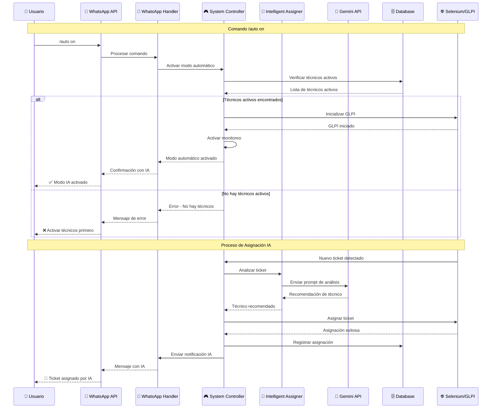
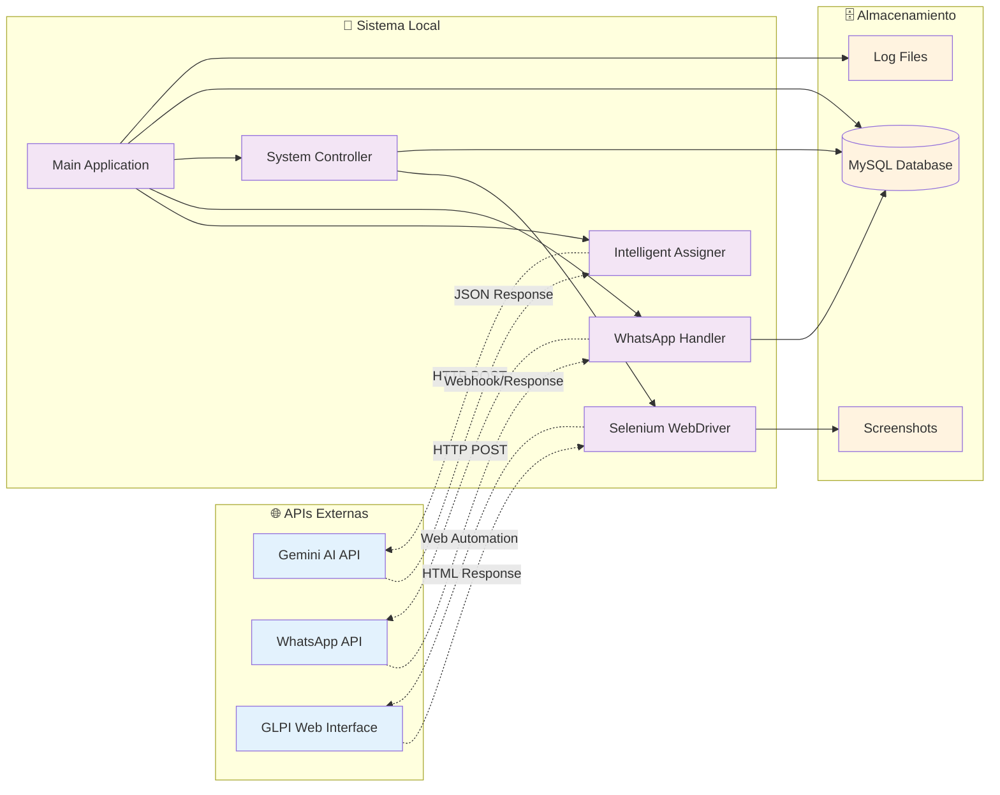
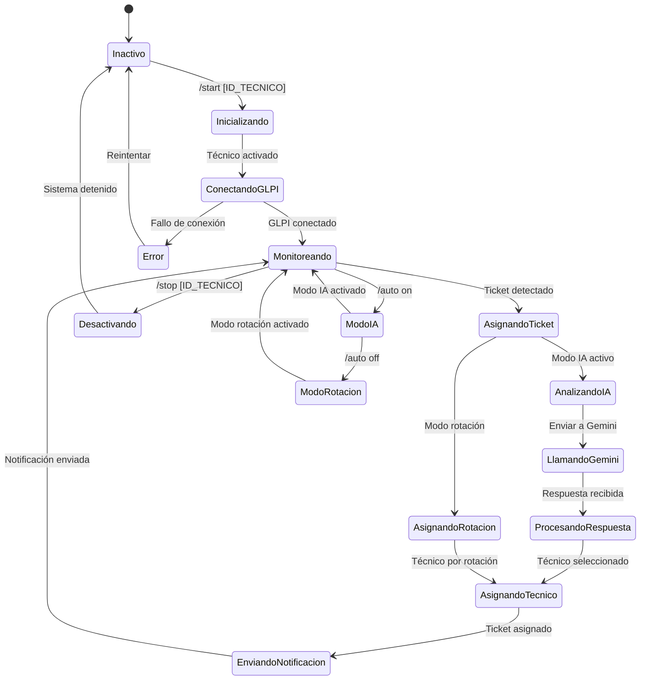
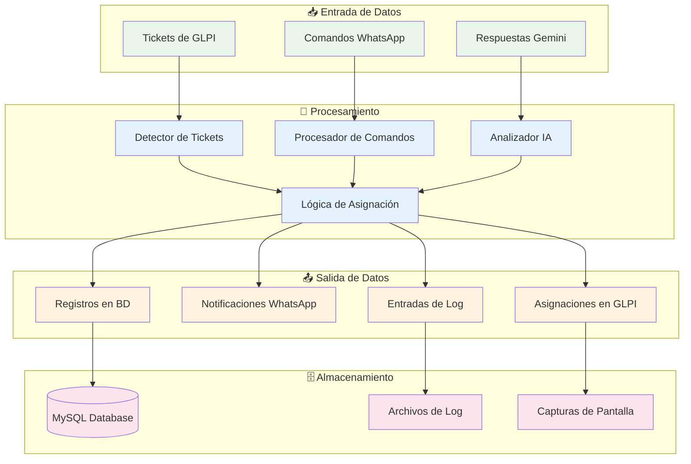

# 🤖 Diagramas del Sistema de Asignación Automática de Tickets

## 📊 Diagrama de Arquitectura General



## 🔄 Diagrama de Flujo de Asignación Inteligente



## 📱 Diagrama de Comandos WhatsApp



## 🎯 Diagrama de Criterios de Asignación

```mermaid
mindmap
  root((Criterios de Asignación))
    N1
      Problemas básicos
      Consultas generales
      Soporte nivel 1
      Técnicos: Kenyo (26586), Juan Daniel (29298)
    Redes/Equipos
      Configuración de redes
      Switches y routers
      Infraestructura de red
      Asignación de equipos
      Nuevo ingreso
      Cese
      Técnico: Luis Alberto (27401)
    Hardware/Mantenimiento
      Reparación de equipos
      Mantenimiento de equipos
      Problemas de hardware
      Equipamiento
      Técnico: Alexander (24935)
    Otros
      Casos especiales
      Tickets sin categoría
      Misceláneos
      Técnico: Jonathan (12429)
    Fallback
      Rotación simple
      Palabras clave
      Técnico disponible
```

## 🔗 Diagrama de Conexiones de APIs



## ⚡ Diagrama de Estados del Sistema



## 📊 Diagrama de Flujo de Datos



---

## 📋 Resumen de Componentes

### 🔧 **Componentes Principales:**
- **Selenium WebDriver**: Automatización de GLPI
- **WhatsApp API**: Comunicación con usuarios
- **Gemini AI API**: Análisis inteligente de tickets
- **MySQL Database**: Almacenamiento de configuraciones y estadísticas

### 🔄 **Flujos Principales:**
1. **Detección**: Selenium monitorea GLPI cada 30 segundos
2. **Análisis**: Gemini AI analiza contenido del ticket
3. **Asignación**: Sistema asigna basándose en criterios y IA
4. **Notificación**: WhatsApp envía confirmación al usuario
5. **Registro**: Base de datos guarda estadísticas y logs

### 🎯 **Criterios de Asignación:**
- **N1**: Kenyo Alfonso (26586) y Juan Daniel (29298)
- **Redes/Equipos**: Luis Alberto (27401)
- **Hardware/Mantenimiento**: Alexander Antonio (24935)
- **Otros**: Jonathan Deaves (12429) 
